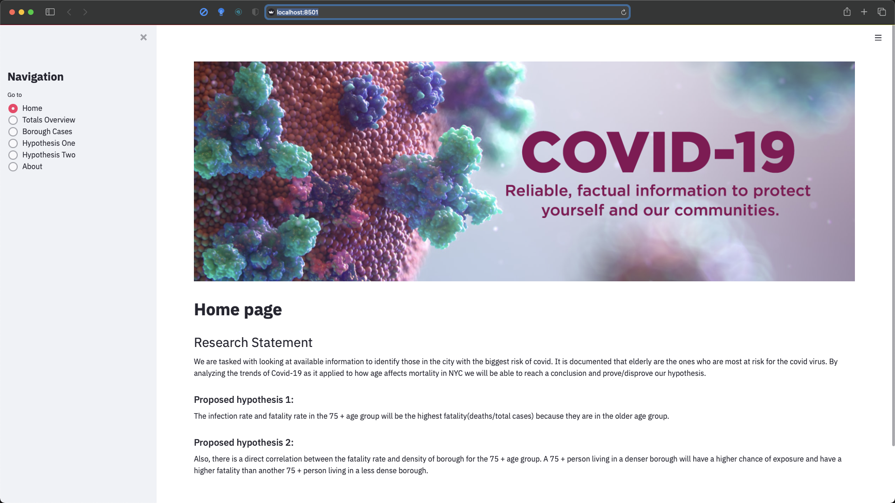
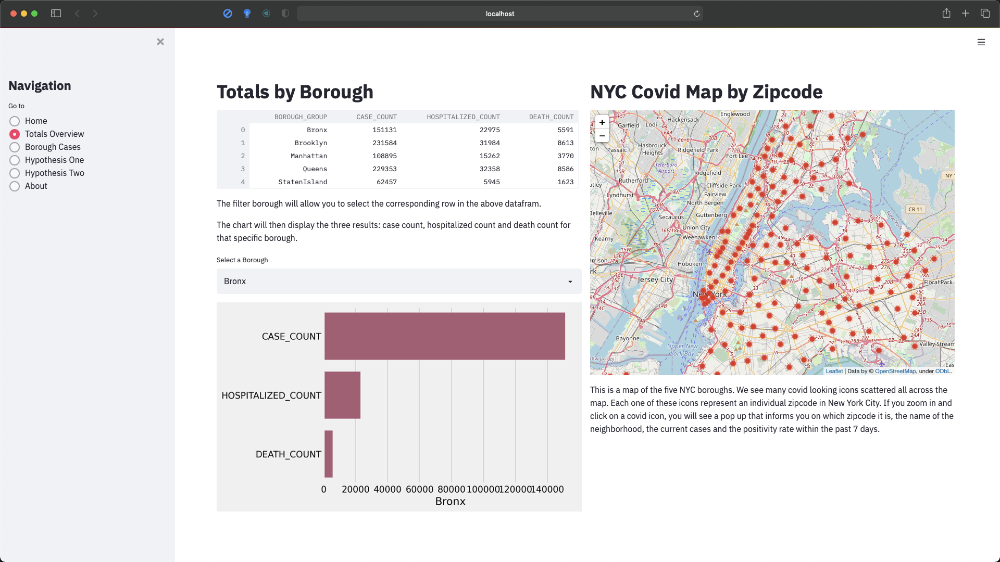
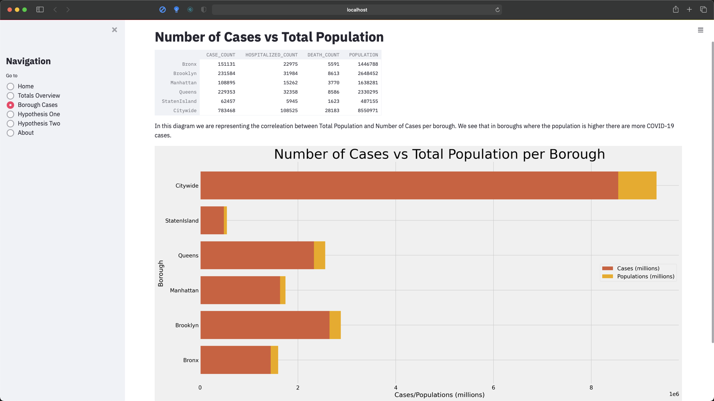

## Contents

- [Acknowledgement](#acknowledgement)
- [Introduction](#introduction)
- [Installation](#installation)
- [Technology Stack](#technology-stack)
- [Data Cleaning](#data-cleaning)
- [Hypothesis](#hypothesis)
- [Conclusion](#conclusion)
- [About us](#about-us)

# COVID-19 IN NYC DATA ANALYSIS

# Acknowledgement
Our team would like to thank all instructors at The Knowledge House for their guidance, help, encouragement and inspiration to complete this Capstone Project. This wouldn't have been possible without you. We would also like to thank The NYC Department of Health for proving the data we used for this study. 

# Introduction
**We are tasked with looking at available information to identify those in the city with the biggest risk of covid. It is documented that elderly are the ones who are most at risk for the covid virus. By analyzing the trends of Covid-19 as it applied to how age affects mortality in NYC we will be able to reach a conclusion and prove/disprove our hypothesis.**

The source of our data is [NYC Department of Health Github's Page](https://github.com/nychealth/coronavirus-data) on Covid-19 statistices, which is updated daily.

 

# Installation

In order to run this application locally on you machine you would need to follow these instructions:
1. In your terminal type:  "pip install pipenv" - this will create the enviroment
2. In order to activate the enviroment type: "pipenv shell"
3. In order to install all packages needed type: "pipenv install"
4. And finally you can run the app by typing this command: "streamlit run app.py"

 

 

 

 

# Technology Stack
In this analysis, we used python as the primary programming language because of its rich palette of tools that make data analysis a cinch. Some of the packages we used are
| Library | Description |
| --- | --- |
| [Matplotlib](https://matplotlib.org/) | Matplotlib is an extremely versatile library of tools for generating interactive plots that are easy to interpret and customise. |
| [Numpy](https://github.com/numpy/numpy) | Numpy is a popular library used for array manipulation and vector operations. It is used extensively across python projects that require scientific computing. |
| [Pandas](https://pandas.pydata.org/pandas-docs/stable/user_guide/10min.html) | Pamdas is another library for data science that is just as popular as numpy. It provides easy to use data structures and functions to manipulate structured data. |
| [Seaborn](https://seaborn.pydata.org/) | Seaborn is a Python data visualization library based on matplotlib. It provides a high-level interface for drawing attractive and informative statistical graphics. |
| [Streamlit](https://streamlit.io) | Streamlit lets you turn data scripts into sharable web apps in minutes, not weeks. It's all Python, open-source, and free! |
| [Folium](https://python-visualization.github.io/folium/) | Folium makes it easy to visualize data that’s been manipulated in Python on an interactive leaflet map. It enables both the binding of data to a map for choropleth visualizations as well as passing rich vector/raster/HTML visualizations as markers on the map. |

These tools are well documented and come with several examples that make it easy to start using them. You can check out the linked documentation pages for more information.

# Data Cleaning

The most important step to take before we get started genenrating any kind of information from these data sources, is to first clean our data and make sure that the datasets are compatible with each other. One of the most important things we need to pay attantion to are the age groups, for some of the datasets there is missing information for the youngest (0-17), so we will fill those missing values by combining the previus age subgroups (0-4, 5-12, 13-17).

### What should we look into / errors?

# Hypothesis
#### What are our proposed Hypothesis? 

## Hypothesis 1

#### The infection rate and fatality rate in the 75+ age group will be the highest fatality(deaths/total cases) because they are in the older age group.

## Hypothesis 2
#### Also,there is a direct correlation between the fataly rate and density of borough for the 75+ age group. A 75+ person living in a denser borough will have a higher chance of exposure and have a higher fatality than another 75+ person living in a less dense borough.

# Conclusion¶

By exploring the correlation between the Number of COVID-19 Cases and the Fatality Rate per Age Group. We were able to conclude that there is no direct correlation between the number of cases per Age Group and the Fatality Rate per Age Group. However, we were able to prove our First Hypothesis, where we have stated that the Fatality Rate increases as people\'s age increase. We saw that the number for Fatality Rate was the highest for the 75+ age group.

In our second hypothesis we stated that there is a direct correlation between the fataly rate and density of a borough for the 75+ age group, however our findings and graphs did't supprt this statement. We were able to conclude that there is no direct correlation between the fatality rate and the density of a borough for the 75+ age group. This pattern could be a result of other socioeconomic factors that we weren't taking into consideration in this research.

# About us

| Preview                                                                                                                                                                                                                                     | Description                                                                                                                                                                                                                                                  |
| ------------------------------------------------------------------------------------------------------------------------------------------------------------------------------------------------------------------------------------------- | ------------------------------------------------------------------------------------------------------------------------------------------------------------------------------------------------------------------------------------------------------------ |
|                                                                                                                                                 | Clariza is an Ambitious data science fellow committed to academic excellence. Prepared to implement diverse skill sets, technical proficiencies and new perspectives to leadership personnel. Adaptable and driven with strong work ethic and ability to thrive in team-based or individually motivated settings. At her core, she is a problem solver and experimenter who’s passionate about using sociological and data driven approaches to tackling projects and building meaningful products that help people live better lives.                                                                                  |
|                                                                                                                                                 | Kari is a Data Analyst and a multi-disciplinary tech enthusiast aspiring to be a Machine Learning Engineer. His flexibility with modern day technologies allows him to build fine projects with great detail. He spends his time pursuing opprtunities of great advancements and projects to develop and sharpen his skillset.|
|                                                                                                                                                 | Stanislava is a life-long learner with a background in Marketing and a passion for Data Science & Cybersecurity Awareness. Team-focused, resourceful, and detail-oriented with a successful record of over 7 years of client-facing experience. Able to effectively bridge the gap between Engineering and Business Teams, along with the capability of rendering excellent technical and communications skills.|
|                                                                                                                                                 | Juan is a business Intelligence Analyst, Experienced on T-SQL Data Engineering, Analytics & Programming.Very familiarized on Systems SLDC analysis, design, development, implementation and support. Microsoft BI Data tools.|